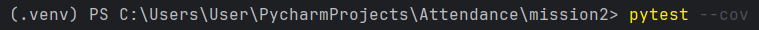
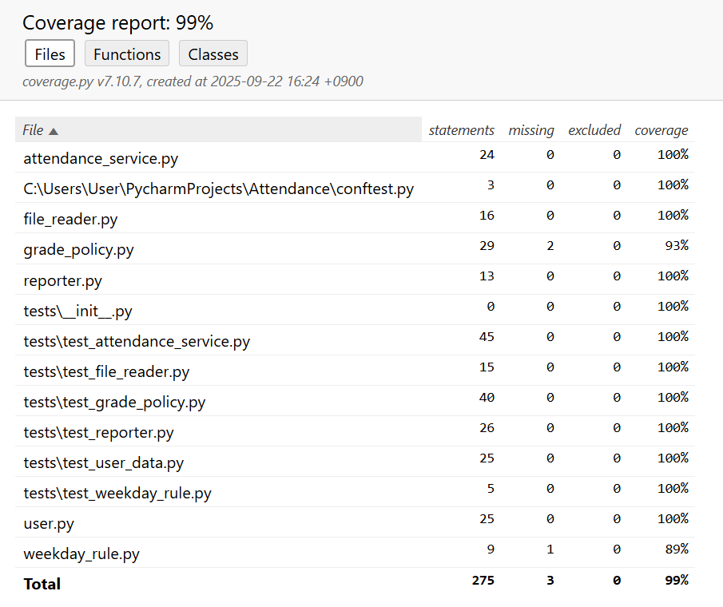

# Attendance

StrategyPattern 적용

| 요구사항 | 체크 (O/X) |
|------|----------|
| D1   | O        |
| D2   | O        |
| D3   | O        |
| D4   | O        |
| D5   | O        |

pytest --cov 실행은 다음과 같이 mission2 폴더 밑에서 진행해주세요!

코드 커버리지 측정 결과
